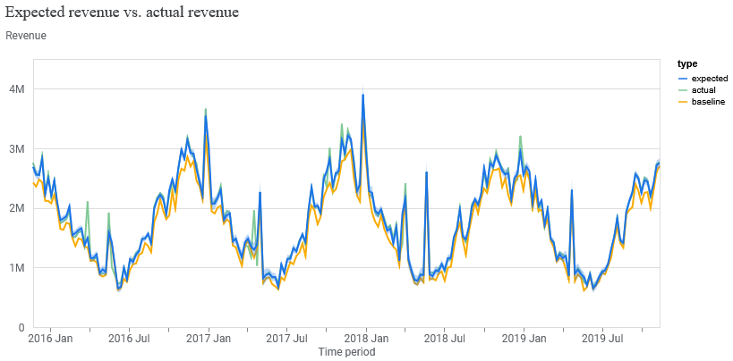
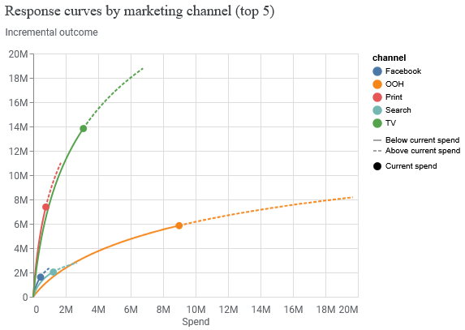

# Marketing Mix Modeling with Google Meridian

## Overview
This project implements a Bayesian Marketing Mix Model (MMM) using Google's open-source Meridian library to analyze marketing channel effectiveness and optimize budget allocation.

## Data
- Source: Meta's Robyn simulated dataset (4 years of weekly data)
- Channels: TV, OOH, Print, Facebook, Search
- Target: Revenue

## Methodology
1. **Data Processing**: Cleaned and prepared weekly marketing data
2. **Model Specification**: Bayesian MMM with LogNormal priors for ROI
3. **MCMC Sampling**: 10 chains × 1000 posterior samples
4. **Validation**: Model diagnostics passed (R-hat < 1.2, R² = 0.98)

## Key Findings

### Model Performance
- R² = 0.98 (explains 98% of revenue variation) 
- MAPE = 3% (predictions within 3% of actuals)

### Channel Contribution
| Channel | Revenue Contribution | ROI | Marginal ROI | Current Spend |
|---------|---------------------|-----|--------------|---------------|
| Baseline | 91.9% | - | - | - |
| TV | 3.7% | 4.48x | 1.97x | 21.3% |
| Print | 2.0% | 9.53x | 5.41x | 5.3% |
| OOH | 1.5% | 0.65x | 0.32x | 61.9% |
| Search | 0.5% | 1.66x | 0.77x | 8.5% |
| Facebook | 0.4% | 3.61x | 1.96x | 3.1% |

### Visualizations
 

## Strategic Insights

### KEY FINDINGS  
- Model explains 98% of sales variance (R² = 0.98) with 3% forecast error (MAPE/wMAPE).  
- Baseline drives 91.9% of sales; TV contributes 3.7%, OOH 1.5%, Print 2.0%.  
- Print has highest ROI (9.53) but marginal ROI (5.41) suggests saturation.  

### CHANNEL ANALYSIS  

**TV**: ROI: 4.48 | Marginal ROI: 1.97 | **Saturated** (marginal ROI < baseline contribution).  
**Print**: ROI: 9.53 | Marginal ROI: 5.41 | **Saturated** (marginal ROI < ROI).  
**OOH**: ROI: 0.65 | Marginal ROI: 0.32 | **Underperforming** (low ROI, high spend: 61.9%).  
**Facebook**: ROI: 3.61 | Marginal ROI: 1.96 | **Saturated** (marginal ROI < ROI).  
**Search**: ROI: 1.66 | Marginal ROI: 0.77 | **Underperforming**.  

### RECOMMENDATIONS 
According to local inference of Qwen3-14B-UD-Q8_K_XL.
- **Reduce OOH spend by 40%** (from 61.9% to 37.1%) to reallocate to higher-ROI channels.  
- **Increase Print budget by 15%** (from 5.3% to 6.1%) to leverage remaining marginal ROI.  
- **Cut TV spend by 10%** (from 21.3% to 19.2%) due to saturation.  
- **Allocate 5% more to Facebook** (from 3.1% to 3.4%) for incremental lift.  

### EXPECTED IMPACT  
- **+2.5% sales lift** from Print reallocation (leveraging 5.41 marginal ROI).  
- **-1.2% sales drag** from OOH reduction (low ROI channel).  
- **+0.8% sales lift** from Facebook increase (1.96 marginal ROI).  
- Overall **+2.1% net sales improvement** with optimized allocation.

## Technical Details
- **Framework**: Google Meridian (TensorFlow Probability)
- **Language**: Python
- **Key Libraries**: pandas, numpy, matplotlib, meridian
- **LLM Integration**: Local Qwen 3B for strategic analysis

## Files
- `mmm_analysis.ipynb` - Main analysis notebook
- `summary_output.html` - Complete model report
- `data/` - Source data
- `README.md` - This file

## References
- [Google Meridian Documentation](https://developers.google.com/meridian)
- [Meta Robyn Dataset](https://github.com/facebookexperimental/Robyn/blob/main/python/src/robyn/tutorials/resources/dt_simulated_weekly.csv)